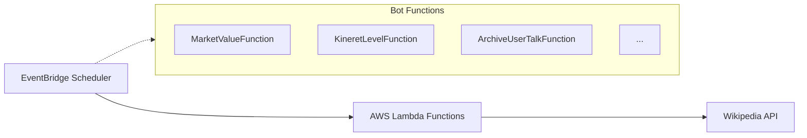
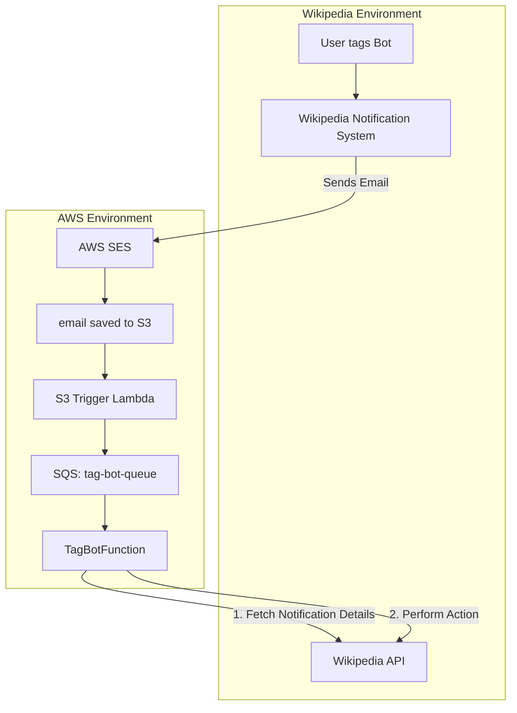

  

## Wiki Bot
This bot operates in the AWS environment, and updates the Hebrew Wikipedia.

### Tasks
* Daily updates to market values of companies via [dedicated template](https://he.wikipedia.org/wiki/%D7%AA%D7%91%D7%A0%D7%99%D7%AA:%D7%A9%D7%95%D7%95%D7%99_%D7%A9%D7%95%D7%A7_%D7%97%D7%91%D7%A8%D7%94_%D7%91%D7%95%D7%A8%D7%A1%D7%90%D7%99%D7%AA). 
* Update yearly reports data.
* More tasks here - https://he.wikipedia.org/wiki/user:Sapper-bot

### AWS Architecture

#### Scheduled Bots (e.g., Market Value, Kineret Level)

#### Tag Bot (Full Cycle)

### CI - CD
CI run on each PR before merging to master. After merging, CD run to updates production environment.
